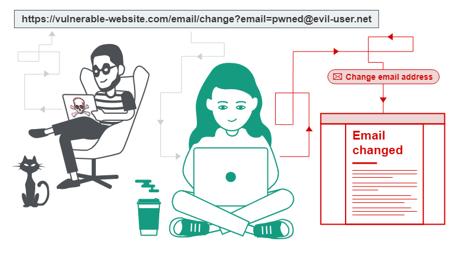
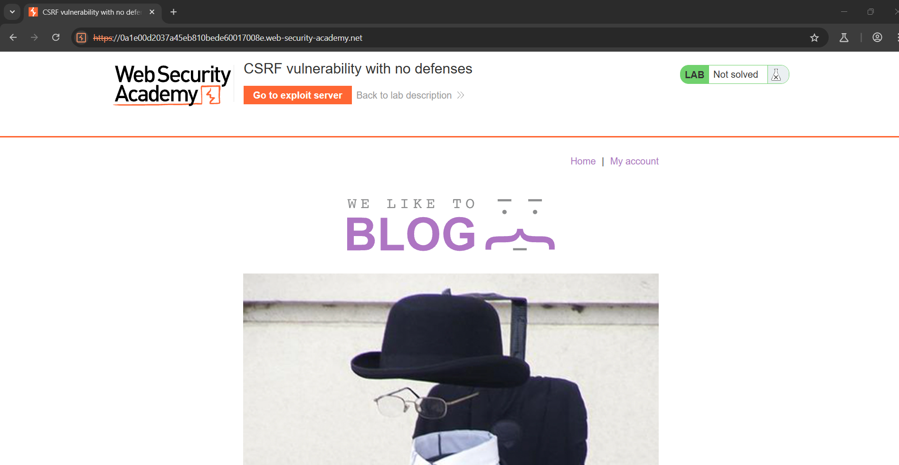
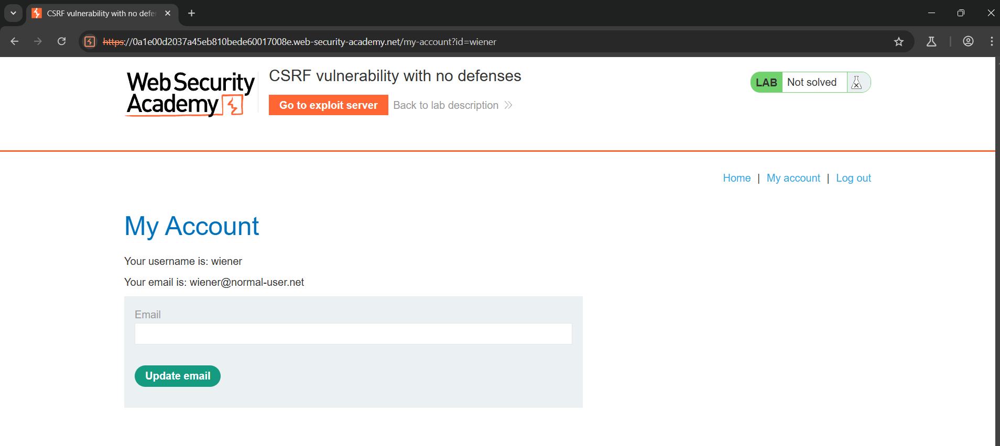

## CSRF - Cross Site Request Forgery 

- **CSRF** là một lỗ hổng bảo mật web cho phép kẻ tấn công dụ dỗ người dùng thực hiện các hành động mà họ không có ý định thực hiện. Nó cho phép kẻ tấn công tránh một phần chính sách cùng nguồn gốc, được thiết kế để ngăn các trang web khác nhau can thiệp lẫn nhau.

    

## Tác động của CSRF

- Trong một cuộc tấn công CSRF thành công, kẻ tấn công khiến người dùng nạn nhân thực hiện một hành động vô ý. Ví dụ, có thể là thay đổi địa chỉ email trên tài khoản của họ, thay đổi mật khẩu hoặc thực hiện chuyển tiền... Tùy thuộc vào bản chất của hành động, kẻ tấn công có thể giành được quyền kiểm soát hoàn toàn đối với tài khoản của người dùng. Nếu người dùng bị xâm phạm có vai trò đặc quyền trong ứng dụng, thì kẻ tấn công có thể giành được quyền kiểm soát hoàn toàn đối với tất cả dữ liệu và chức năng của ứng dụng.

## CSRF hoạt động như thế nào?

- Để có thể thực hiện một cuộc tấn công CSRF, ba điều kiện chính phải có:

    - **Một hành động có liên quan.** Có một hành động trong ứng dụng mà kẻ tấn công có lý do để thực hiện. Đây có thể là một hành động đặc quyền (chẳng hạn như sửa đổi quyền cho người dùng khác) hoặc bất kỳ hành động nào trên dữ liệu cụ thể của người dùng (chẳng hạn như thay đổi mật khẩu của chính người dùng).
    - **Xử lý phiên dựa trên cookie.** Thực hiện hành động liên quan đến việc phát hành một hoặc nhiều yêu cầu HTTP và ứng dụng chỉ dựa vào cookie phiên để xác định người dùng đã thực hiện các yêu cầu. Không có cơ chế nào khác để theo dõi các phiên hoặc xác thực các yêu cầu của người dùng.
    - **Không có tham số yêu cầu không thể đoán trước.** Các yêu cầu thực hiện hành động không chứa bất kỳ tham số nào mà kẻ tấn công không thể xác định hoặc đoán giá trị của chúng. Ví dụ: khi khiến người dùng thay đổi mật khẩu của họ, chức năng này không dễ bị tấn công nếu kẻ tấn công cần biết giá trị của mật khẩu hiện tại.

- Ví dụ, giả sử một ứng dụng chứa một hàm cho phép người dùng thay đổi địa chỉ email trên tài khoản của họ. Khi người dùng thực hiện hành động này, họ sẽ thực hiện một yêu cầu HTTP như sau:

    ```bash
    POST /email/change HTTP/1.1
    Host: vulnerability-website.com
    Content-Type: application/x-www-form-urlencoded
    Content-Length: 30
    Cookie: session=yvthwsztyeQkAPzeQ5gHgTvlyxHfsAfE

    email=wiener@normal-user.com
    ```
- Điều này đáp ứng các điều kiện bắt buộc đối với CSRF:
    - Hành động thay đổi địa chỉ email trên tài khoản của người dùng là mối quan tâm của kẻ tấn công. Sau hành động này, kẻ tấn công thường có thể kích hoạt đặt lại mật khẩu và kiểm soát hoàn toàn tài khoản của người dùng.
    - Ứng dụng sử dụng cookie phiên để xác định người dùng nào đã đưa ra yêu cầu. Không có mã thông báo hoặc cơ chế nào khác để theo dõi phiên của người dùng.
    - Kẻ tấn công có thể dễ dàng xác định các giá trị của các tham số yêu cầu cần thiết để thực hiện hành động.

- Với những điều kiện này, kẻ tấn công có thể xây dựng một trang web có chứa mã HTML sau:
    ```bash
    <html>
        <body>
            <form action="https://vulnerable-website.com/email/change" method="POST">
                <input type="hidden" name="email" value="pwned@evil-user.net" />
            </form>
            <script>
                document.forms[0].submit();
            </script>
        </body>
    </html>
    ```

- Nếu người dùng nạn nhân truy cập trang web của kẻ tấn công, những điều sau đây sẽ xảy ra:

    - Trang của kẻ tấn công sẽ kích hoạt yêu cầu HTTP đến trang web dễ bị tấn công.
    - Nếu người dùng đã đăng nhập vào trang web dễ bị tấn công, trình duyệt của họ sẽ tự động bao gồm `cookie phiên của họ trong yêu cầu (giả sử cookie SameSite không được sử dụng).
Trang web dễ bị tấn công sẽ xử lý yêu cầu theo cách thông thường, coi như yêu cầu đó được thực hiện bởi người dùng nạn nhân và thay đổi địa chỉ email của họ.

## Xây dựng kịch bản tấn công CSRF 

- Việc tạo thủ công HTML cần thiết cho một cuộc tấn công CSRF có thể khá phức tạp, đặc biệt khi yêu cầu cần chứa một số lượng lớn tham số hoặc có các đặc thù khác trong yêu cầu đó. Cách dễ nhất để tạo một tấn công CSRF là sử dụng trình tạo `PoC CSRF` được tích hợp trong Burp Suite Professional:

    - Chọn một yêu cầu (request) bất kỳ trong Burp Suite Professional mà bạn muốn kiểm tra hoặc khai thác.
    - Từ menu ngữ cảnh (chuột phải), chọn `Engagement tools / Generate CSRF PoC`.
    - Burp Suite sẽ tạo một đoạn mã HTML có khả năng kích hoạt yêu cầu đã chọn (ngoại trừ cookie, vì trình duyệt của nạn nhân sẽ tự động thêm cookie).
    - Bạn có thể tinh chỉnh các tùy chọn trong trình tạo `PoC CSRF` để điều chỉnh chi tiết của cuộc tấn công. Điều này có thể cần thiết trong một số trường hợp đặc biệt để xử lý các đặc điểm không chuẩn của yêu cầu.
    - Sao chép đoạn mã HTML đã tạo vào một trang web, mở nó trong trình duyệt đang đăng nhập vào trang web dễ bị tấn công và kiểm tra xem yêu cầu có được thực hiện thành công hay không, cũng như hành động mong muốn có xảy ra hay không.

### Lab: CSRF vulnerability with no defenses

- Trang web của bài Lab
    
- Đăng nhập với tài khoản `wiener:peter`
    


