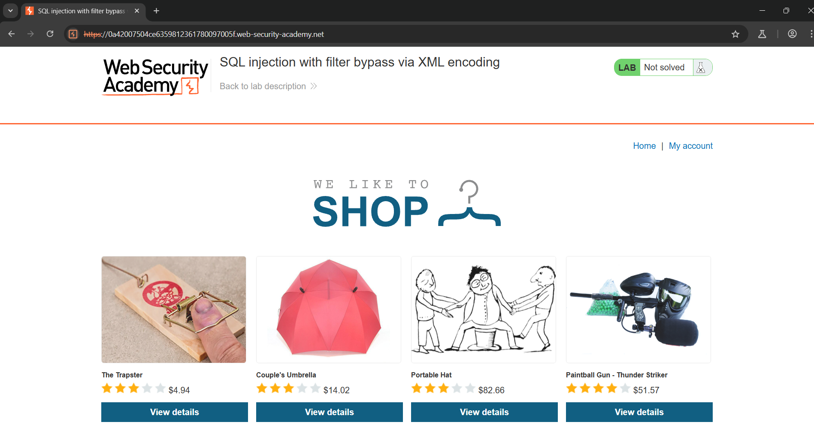
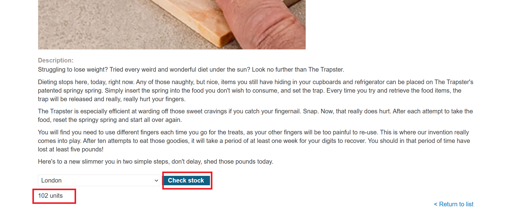
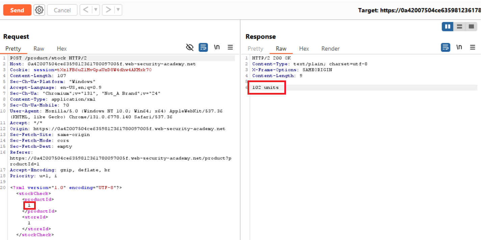
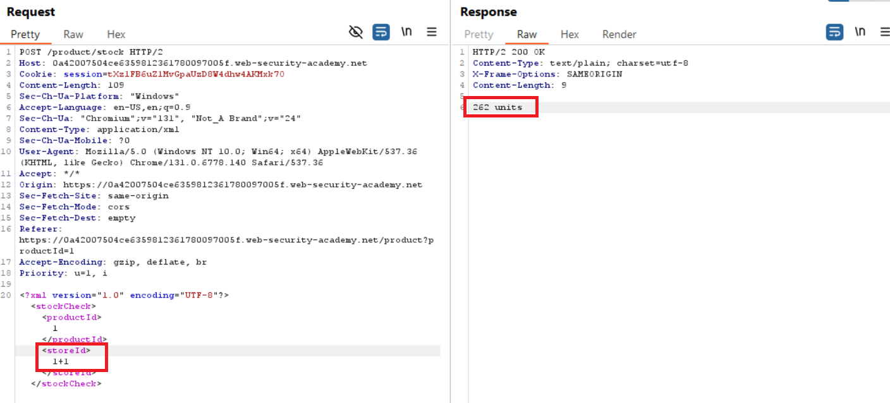
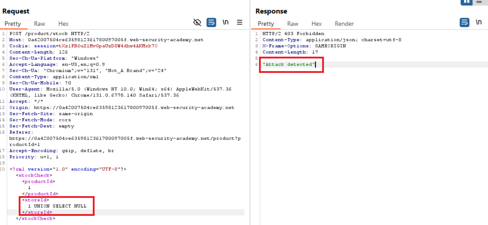
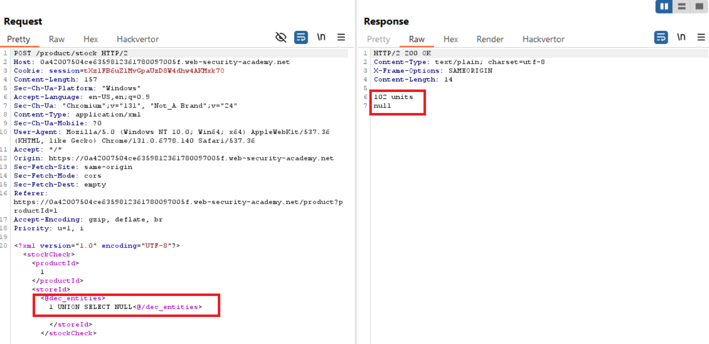
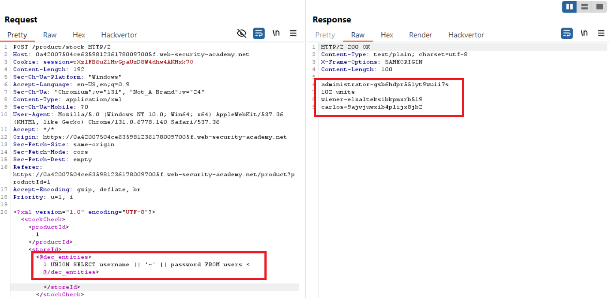
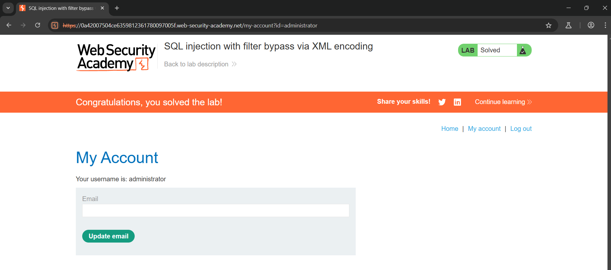
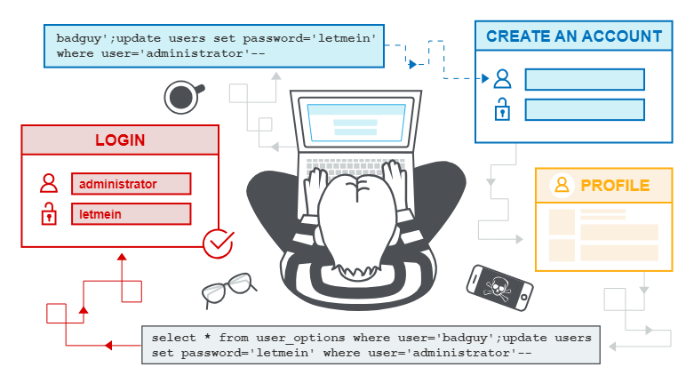

## What is SQL injection (SQLi)?
- SQL injection (SQLi) is a web security vulnerability that allows an attacker to interfere with the queries that an application makes to its database. This can allow an attacker to view data that they are not normally able to retrieve. This might include data that belongs to other users, or any other data that the application can access. In many cases, an attacker can modify or delete this data, causing persistent changes to the application's content or behavior.

- In some situations, an attacker can escalate a SQL injection attack to compromise the underlying server or other back-end infrastructure. It can also enable them to perform denial-of-service attacks.

## How to detect SQL injection vulnerabilities
- You can detect SQL injection manually using a systematic set of tests against every entry point in the application. To do this, you would typically submit:

    - The single quote character ' and look for errors or other anomalies.
    - Some SQL-specific syntax that evaluates to the base (original) value of the entry point, and to a different value, and look for systematic differences in the application responses.
    - Boolean conditions such as OR 1=1 and OR 1=2, and look for differences in the application's responses.
    - Payloads designed to trigger time delays when executed within a SQL query, and look for differences in the time taken to respond.
    - OAST payloads designed to trigger an out-of-band network interaction when executed within a SQL query, and monitor any resulting interactions.
- Alternatively, you can find the majority of SQL injection vulnerabilities quickly and reliably using Burp Scanner.

## SQL injection in different parts of the query
- Most SQL injection vulnerabilities occur within the `WHERE` clause of a `SELECT` query. Most experienced testers are familiar with this type of SQL injection.

- However, SQL injection vulnerabilities can occur at any location within the query, and within different query types. Some other common locations where SQL injection arises are:

    - In `UPDATE` statements, within the updated values or the `WHERE` clause.
    - In `INSERT` statements, within the inserted values.
    - In `SELECT` statements, within the table or column name.
    - In `SELECT` statements, within the `ORDER BY` clause.


## SQL injection in different contexts
In the previous labs, you used the query string to inject your malicious SQL payload. However, you can perform SQL injection attacks using any controllable input that is processed as a SQL query by the application. For example, some websites take input in JSON or XML format and use this to query the database.

These different formats may provide different ways for you to obfuscate attacks that are otherwise blocked due to WAFs and other defense mechanisms. Weak implementations often look for common SQL injection keywords within the request, so you may be able to bypass these filters by encoding or escaping characters in the prohibited keywords. For example, the following XML-based SQL injection uses an XML escape sequence to encode the S character in SELECT:
```bash
<stockCheck>
    <productId>123</productId>
    <storeId>999 &#x53;ELECT * FROM information_schema.tables</storeId>
</stockCheck>
```
This will be decoded server-side before being passed to the SQL interpreter.

### Lab: SQL injection with filter bypass via XML encoding

- Trang web
    

- View chi tiết
    
- Burp Repeater
    
- Bypass
    
    - Tiếp tục
    
    - Tiếp
    
    - Tiếp
    
- Login vào tài khoản admin là solve lab
    

## Second-order SQL injection
- First-order SQL injection occurs when the application processes user input from an HTTP request and incorporates the input into a SQL query in an unsafe way.

- Second-order SQL injection occurs when the application takes user input from an HTTP request and stores it for future use. This is usually done by placing the input into a database, but no vulnerability occurs at the point where the data is stored. Later, when handling a different HTTP request, the application retrieves the stored data and incorporates it into a SQL query in an unsafe way. For this reason, second-order SQL injection is also known as stored SQL injection.

    

- Second-order SQL injection often occurs in situations where developers are aware of SQL injection vulnerabilities, and so safely handle the initial placement of the input into the database. When the data is later processed, it is deemed to be safe, since it was previously placed into the database safely. At this point, the data is handled in an unsafe way, because the developer wrongly deems it to be trusted.

## How to prevent SQL injection

- You can prevent most instances of SQL injection using parameterized queries instead of string concatenation within the query. These parameterized queries are also know as "prepared statements".

- The following code is vulnerable to SQL injection because the user input is concatenated directly into the query:
    ```sql
    String query = "SELECT * FROM products WHERE category = '"+ input + "'";
    Statement statement = connection.createStatement();
    ResultSet resultSet = statement.executeQuery(query);
    ```
- You can rewrite this code in a way that prevents the user input from interfering with the query structure:
    ```sql
    PreparedStatement statement = connection.prepareStatement("SELECT * FROM products WHERE category = ?");
    statement.setString(1, input);
    ResultSet resultSet = statement.executeQuery();
    ```
- You can use parameterized queries for any situation where untrusted input appears as data within the query, including the `WHERE` clause and values in an `INSERT` or `UPDATE` statement. They can't be used to handle untrusted input in other parts of the query, such as table or column names, or the `ORDER BY` clause. Application functionality that places untrusted data into these parts of the query needs to take a different approach, such as:

    - Whitelisting permitted input values.
    Using different logic to deliver the required behavior.
    - For a parameterized query to be effective in preventing SQL injection, the string that is used in the query must always be a hard-coded constant. It must never contain any variable data from any origin. Do not be tempted to decide case-by-case whether an item of data is trusted, and continue using string concatenation within the query for cases that are considered safe. It's easy to make mistakes about the possible origin of data, or for changes in other code to taint trusted data.